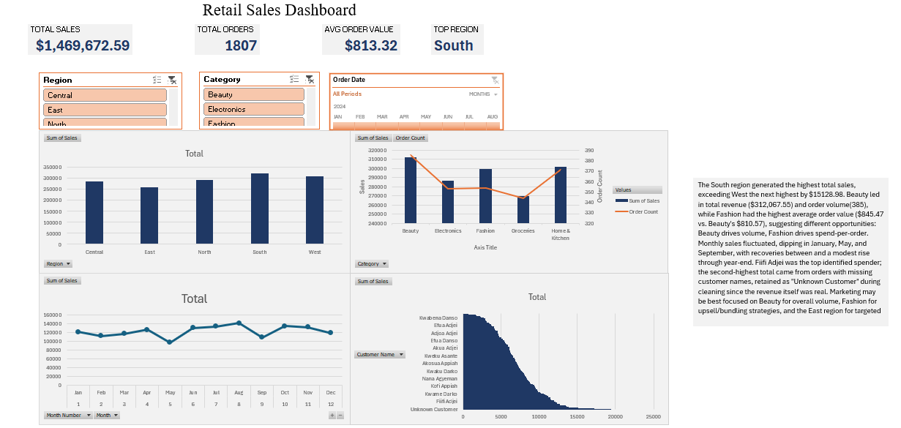

# Retail Sales Dashboard (Excel)

An interactive Excel dashboard analyzing retail sales data from raw, messy source data through cleaning, pivot table analysis, and a slicer-driven dashboard with dynamic KPIs.

## Tools Used
- Microsoft Excel (Pivot Tables, Slicers, Timelines, GETPIVOTDATA, formula-based data cleaning)

## The Dataset
The source data (`data/retail_sales_raw.csv`) contained 1,830 rows of order-level sales records across 5 regions, 5 product categories, and 25 products. It included deliberate real-world data quality issues:
- Inconsistent region naming (e.g. "North", "north", "NORTH", "N.")
- Four different date formats mixed within a single column
- Missing values in Sales Rep and Customer Name fields
- 30 exact duplicate rows
- 10 records with impossible data (zero quantity paired with non-zero sales)

## Data Cleaning Process
- Standardized region names using PROPER/TRIM and Find & Replace
- Parsed and unified inconsistent date formats using nested IF/DATEVALUE logic
- Removed duplicate rows (13 of 30 known duplicates were caught via Excel's Remove Duplicates on first pass; remaining discrepancy noted below)
- Filled missing Sales Rep and Customer Name values with "Unassigned"/"Unknown Customer" rather than deleting records, to preserve real revenue data
- Removed 10 records with Quantity = 0, an impossible combination indicating data entry error
- Added calculated columns (Month, Month Number, and a Sales recalculation check) for analysis and validation
- **Final dataset:** 1,808 rows, $1,469,673 total sales
- **Known limitation:** Remove Duplicates identified only 13 of the 30 duplicate rows present in the source data, likely due to inconsistent cleaning being applied before deduplication ran. Documented rather than silently corrected.

## Dashboard Features
- 4 pivot-table-driven charts: Sales by Region, Sales by Category (with order count on secondary axis), Monthly Sales Trend, Top 10 Customers
- Region and Category slicers, plus a date Timeline, connected across all visuals
- 4 dynamic KPI cards (Total Sales, Total Orders, Avg Order Value, Top Region) built with GETPIVOTDATA so they respond live to slicer selections
- Consistent 3-color visual theme across charts, KPI cards, and slicers

## Key Insights
The South region generated the highest total sales, exceeding West the next highest by $15128.98. Beauty led in total revenue ($312,067.55) and order volume(385), while Fashion had the highest average order value ($845.47 vs. Beauty's $810.57), suggesting different opportunities: Beauty drives volume, Fashion drives spend-per-order. Monthly sales fluctuated, dipping in January, May, and September, with recoveries between and a modest rise through year-end. Fiifi Adjei was the top identified spender; the second-highest total came from orders with missing customer names, retained as "Unknown Customer" during cleaning since the revenue itself was real. Marketing may be best focused on Beauty for overall volume, Fashion for upsell/bundling strategies, and the East region for targeted growth given its comparatively lower revenue.

## Dashboard Preview

